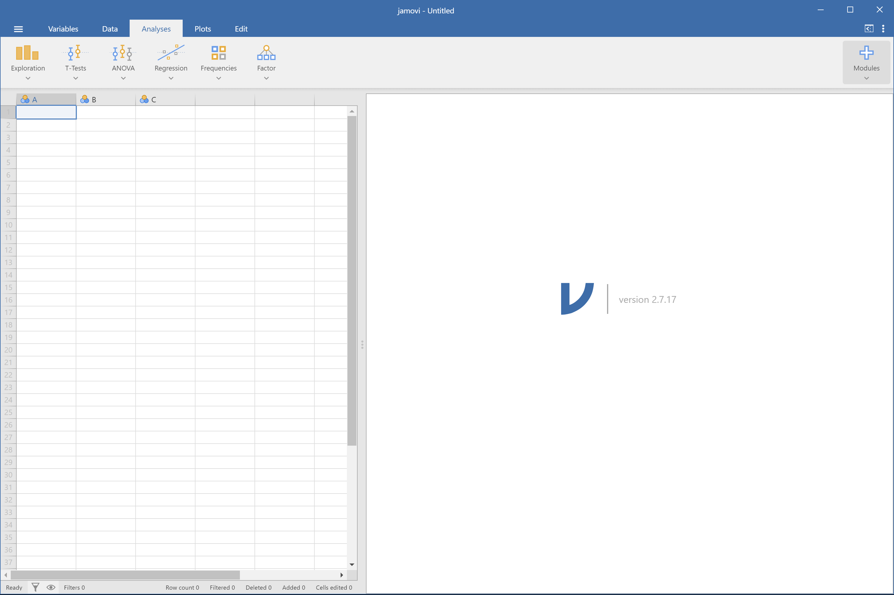

```{r setup, include=FALSE}
knitr::opts_chunk$set(echo = FALSE, warning = FALSE, message = FALSE)
```

# 本週學習目標

## 學習成效指標

1. **匯入資料**：將 CSV 檔案載入 jamovi
2. **設定變項**：認識測量尺度與資料型態
3. **計算變項**：建立新的計算欄位
4. **存檔匯出**：正確儲存與匯出資料

---

## 對應教材

- 《用 jamovi 上手統計學》
  - [第 3 章：與 jamovi 的第一次接觸](https://scgeeker.github.io/lsj-book-zh_tw/)

**示範資料檔**：`booksales.csv`

# Part 1：認識 jamovi 介面

## jamovi 主畫面

{width=80%}

- **左上**：檔案選單（三條橫線 ☰）
- **左側**：資料表 (Data)
- **右側**：分析結果 (Results)
- **上方**：分析選單 (Analyses)

---

## 五大工作區

| 區域 | 功能 |
|------|------|
| **Variable** | 檢視與編輯資料變項 |
| **Data** | 檢視與編輯資料 |
| **Analyses** | 執行統計分析 |
| **Plots** | 製作資料視覺化(v 2.7) |
| **Results/Edit** | 顯示與編輯分析結果 |

# Part 2：匯入資料

## 開啟檔案

**操作步驟**：

1. 點選左上角 **☰**（三條橫線）
2. 選擇 **Open** → **This Device**
3. 選取 `booksales.csv`

---

## 支援的檔案格式

| 格式 | 副檔名 | 來源 |
|------|--------|------|
| jamovi 專案 | `.omv` | jamovi |
| 逗號分隔 | `.csv` | Excel、文字編輯器 |
| SPSS | `.sav` | SPSS |
| Excel | `.xlsx` | Microsoft Excel |

---

## booksales.csv 內容

這份資料記錄某書店的書籍銷售情況：

| 變項 | 說明 |
|------|------|
| `Month` | 月份 |
| `Days` | 該月天數 |
| `Sales` | 銷售冊數 |

# Part 3：設定變項類型

## 為什麼要設定變項？

> **jamovi 會「猜測」變項類型**
> **但常常猜錯！**

你需要告訴 jamovi 每個變項的正確類型

---

## 開啟變項編輯器

**操作步驟**：

1. **雙擊**變項標題列
2. 或點選 **Data** → **Setup**

---

## 測量尺度 (Measure Type)

| 類型 | 圖示 | 說明 | 範例 |
|------|------|------|------|
| **ID** | 🔤 | 識別碼 | 學號、編號 |
| **Nominal** | ⚪⚪⚪ | 名義（類別） | 性別、組別 |
| **Ordinal** | 📊 | 次序 | 滿意度等級 |
| **Continuous** | 📏 | 連續數值 | 分數、身高 |

---

## 資料型態 (Data Type)

| 型態 | 說明 |
|------|------|
| **Text** | 文字 |
| **Integer** | 整數 |
| **Decimal** | 小數 |

---

## 實作練習

請設定 `booksales.csv` 的變項：

| 變項 | 測量尺度 | 資料型態 |
|------|----------|----------|
| `Month` | Nominal | Text |
| `Days` | Continuous | Integer |
| `Sales` | Continuous | Integer |

# Part 4：計算變項

## 什麼是計算變項？

> **根據現有變項，產生新的變項**

例如：計算平均值、轉換分數、反向計分

---

## 建立計算變項

**操作步驟**：

1. 點選 **Data** → **Add** → **Computed Variable**
2. 輸入新變項名稱
3. 在公式欄輸入計算式

---

## 示範：Tooth Growth 資料集

jamovi 內建資料集，記錄維他命 C 對天竺鼠牙齒生長的影響。

**開啟方式**：☰ → Open → Data Library → Tooth Growth

---

## 計算範例

計算 `len` 變項的 Z 分數：

```
(len - VMEAN(len)) / VSTDEV(len)
```

**常用函數**：

| 函數 | 說明 |
|------|------|
| `VMEAN()` | 變項平均值 |
| `VSTDEV()` | 變項標準差 |
| `VSUM()` | 變項總和 |

# Part 5：存檔與匯出

## 儲存 jamovi 專案

**操作**：☰ → **Save As**

- 副檔名：`.omv`
- 保留：資料 + 分析結果 + 設定

---

## 匯出資料

**操作**：☰ → **Export** → **Data**

- 匯出為 `.csv` 供其他軟體使用
- 僅匯出資料，不含分析結果

---

## 檔名規範

⚠️ **作業請嚴格遵守格式**：

```
學號_姓名_W2_Lab.omv
學號_姓名_W2_Report.docx
```

範例：
- `115930001_王小明_W2_Lab.omv`
- `115930001_王小明_W2_Report.docx`

# 本週作業（1 小時實作）

## 作業內容

使用 `booksales.csv` 完成以下任務：

1. 匯入資料
2. 設定正確的變項類型
3. 執行描述統計（Analyses → Exploration → Descriptives）
4. 匯出結果至 Word

---

## 繳交項目與時程

| 檔案 | 格式 | 內容 |
|------|------|------|
| 分析檔 | `學號_姓名_W2_Lab.omv` | 正確設定變項的 jamovi 專案 |

**繳交時間**：本堂課下課前上傳至 Google Classroom

**評量回饋**：2 天內收到個人評量報告

**修正機會**：下次上課前可回報改進版本

---

## 評分標準

| 項目 | 配分 |
|------|------|
| OMV 變項設定正確 | 50% |
| 檔案命名規範 | 50% |

# 關鍵概念複習

## 變項類型判斷口訣

> **能排序但間距不等** → Ordinal
> **能加減乘除** → Continuous
> **只能分類計數** → Nominal
> **只是標籤編號** → ID

---

## 常見錯誤

❌ ID 設為 Continuous（會被當成數字計算）

❌ 月份名稱設為 Continuous（應為 Nominal）

❌ 檔名格式錯誤（無法自動評量）

---

## 下週預告

**W3：描述統計**

- 集中趨勢：平均數、中位數、眾數
- 離散程度：標準差、全距、四分位距
- 分組描述統計

# Q & A

## 有問題嗎？

- 課堂提問
- Google Classroom 討論串
- Office Hour

---

## 參考資源

- 📖 [《用 jamovi 上手統計學》第 3 章](https://scgeeker.github.io/lsj-book-zh_tw/)
- 📁 lsj資料集：`booksales.csv`
- 🎥 [jamovi 官方教學](https://www.jamovi.org/community.html)
